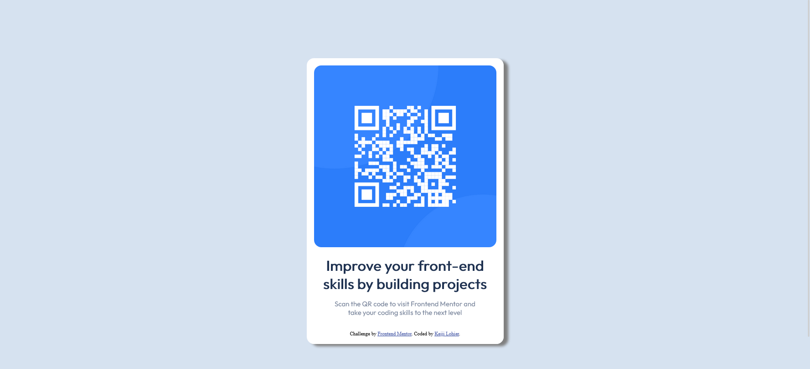

# Frontend Mentor - QR code component solution

This is a solution to the [QR code component challenge on Frontend Mentor](https://www.frontendmentor.io/challenges/qr-code-component-iux_sIO_H). Frontend Mentor challenges help you improve your coding skills by building realistic projects. 

## Table of contents

- [Overview](#overview)
  - [Screenshot](#screenshot)
  - [Links](#links)
  - [Built with](#built-with)
  - [What I learned](#what-i-learned)
- [Author](#author)

## Overview

### Screenshot

### Links

- Solution URL: [https://www.frontendmentor.io/solutions/qr-card-component-using-flex-imggLsVaj](https://www.frontendmentor.io/solutions/qr-card-component-using-flex-imggLsVaj)
- Live Site URL: [https://qr-code-esff7lzal-klohier.vercel.app/](https://qr-code-esff7lzal-klohier.vercel.app/)

### Built with

- Semantic HTML5 markup
- CSS custom properties
- Flexbox

### What I learned

Something I learned was using vw to attempt to make qr code card component responsive as it scaled down to mobile

## Author

- Frontend Mentor - [@dopekg](https://www.frontendmentor.io/profile/dopekg)

